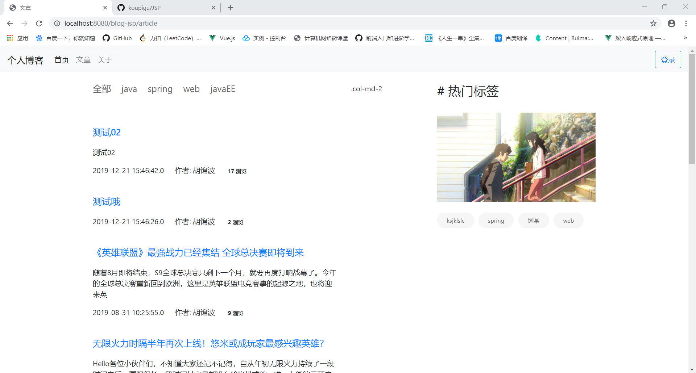

# JSP实训作业

## 项目部署

在/blog-jsp/src/jdbc/connect/DataBaseInfo.java 修改数据库配置信息

访问 http://localhost:8080/blog-jsp/index


## 前台页面展示




![文章详细]](doc/image/文章详细.png)


## sql语句

- 文件表


```sql
create table file
(
	id int auto_increment,
	name varchar(255) null comment '名字',
	url varchar(255) null comment 'url地址',
	type int null comment '类型',
	constraint file_pk
		primary key (id)
)
comment '文件表';
```

## 后台编写完成

**主要功能**

+ **文件管理**
  
  * 文件上传
  
	

  * 文件列表（查看 下载 删除）
  
	

- **文章管理**
  
  * 文章编写
  
	
  
  * 文章列表（查看，删除）
  
	

  * about页面编写（前台about页面展示信息）
  
	

- **分类管理**
 
  * 分类列表

  * 添加分类

  * 修改分类

  * 删除分类
  
  

+ **标签管理**
  
  * 标签列表

  * 修改标签

  * 删除标签
  
  